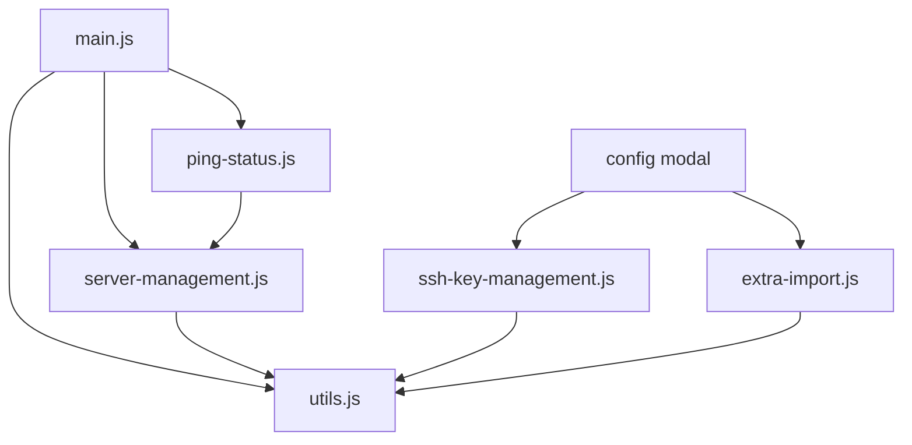

# ServerDeck JavaScript Architecture

## 概要
ServerDeckのフロントエンドJavaScriptは、保守性と可読性を向上させるために機能別にモジュール化されています。

## ドキュメント更新ポリシー
**重要**: このドキュメントは、コード変更、機能追加、削除があるたびに必ず更新してください。
- 新機能追加時: 対応するセクションと詳細を追加
- 機能変更時: 該当部分を最新の実装に合わせて更新
- 機能削除時: 関連セクションを削除または「廃止」として明記
- アーキテクチャ変更時: 構成図や説明を更新

## 開発・デプロイメント
**推奨**: 開発中の変更適用には常に `./restart_full.sh` を使用してください。
- 依存関係の変更がなくても、キャッシュ問題を避けるため完全再構築を推奨
- `./restart_app.sh` は使用せず、一貫して `./restart_full.sh` を使用

## ファイル構造

### 📁 `/static/js/`

| ファイル | サイズ | 責任範囲 | 主要な機能 |
|---------|--------|----------|-----------|
| `main.js` | 1.1 KB | エントリーポイント | ダークモード、初期化 |
| `utils.js` | 4.0 KB | 共通ユーティリティ | 認証UI、API共通処理、エラーハンドリング |
| `ping-status.js` | 3.5 KB | リアルタイム状態管理 | Socket.IO、ping状態表示 |
| `server-management.js` | 22 KB | サーバー管理 | CRUD操作、モーダル、一括操作 |
| `ssh-key-management.js` | 11 KB | SSHキー管理 | キー追加/編集/削除、アップロード |
| `extra-import.js` | 8.9 KB | Extra Import機能 | URL設定、インポート処理、確認ダイアログ |
| `backup-management.js` | 5.7 KB | バックアップ管理 | エクスポート/インポート、ファイル管理 |

**合計: 約56 KB** (元の65 KBから約14%削減)

## モジュール依存関係



## 主要なAPIオブジェクト

### `window.ServerDeckUtils`
- `loadConfigModal()` - 設定モーダルの動的読み込み
- `toggleAuthFields()` - 認証フィールドの表示切り替え
- `handleApiError()` - 共通エラーハンドリング
- `apiRequest()` - 共通APIリクエスト

### `window.PingStatus`
- `initialize()` - Socket.IO初期化
- `updatePingStatus()` - ping状態更新

### `window.ServerManagement`
- `updateMainPageServerCards()` - メインページ更新
- `openEditModalForServer()` - サーバー編集モーダル
- `loadServersForConfigModal()` - 設定画面サーバーリスト
- `attachServerCardEventListeners()` - イベントリスナー管理

### `window.SshKeyManagement`
- `initialize()` - SSHキー管理画面初期化
- `loadSshKeysForManagementModal()` - キーリスト読み込み

### `window.ExtraImport`
- `initialize()` - Extra Import機能初期化
- `showDeleteConfirmation()` - 削除確認ダイアログ

### `window.BackupManagement`
- `initialize()` - バックアップ管理機能初期化
- `exportConfig()` - 設定のエクスポート
- `importConfig()` - 設定のインポート
- `loadBackupFileList()` - バックアップファイル一覧読み込み

## 読み込み順序

HTMLテンプレートで以下の順序で読み込み：

1. `utils.js` - 共通機能（他のモジュールが依存）
2. `ping-status.js` - Socket.IO機能
3. `server-management.js` - メイン機能
4. `ssh-key-management.js` - SSHキー機能
5. `extra-import.js` - インポート機能
6. `backup-management.js` - バックアップ機能
7. `main.js` - 初期化とエントリーポイント

## 最適化のポイント

### ✅ 改善済み
- **機能分離**: 各ファイルが明確な責任を持つ
- **共通関数**: エラーハンドリング、API呼び出しを統一
- **イベント管理**: 重複したイベントリスナーの除去
- **可読性**: 長い関数を小さな関数に分割
- **thisコンテキスト**: イベントリスナーでの`this`参照問題を解決

### 🐛 修正済みの問題
- **SSHキー管理エラー**: `this.loadSshKeysForManagementModal is not a function`
- **Extra Importエラー**: `this.initializeConfirmModal is not a function`  
- **バックアップ機能**: APIパスの修正とイベントリスナーの修正
- **タブ初期化**: `{ once: true }`オプション削除によるタブ切り替えの安定化

### 🚀 今後の改善案
- **ESモジュール**: `import/export`への移行
- **TypeScript**: 型安全性の向上
- **バンドラー**: Webpack/Vite導入によるさらなる最適化
- **テスト**: ユニットテストの追加

## 開発ガイドライン

### コンテナ再起動
ServerDeckアプリケーションの変更を反映させるには、以下のスクリプトを使用してください：

```bash
# 完全再起動（イメージも再ビルド）
./restart_full.sh

# アプリのみ再起動（Pythonコードの変更時）
./restart_app.sh
```

**使い分け：**
- JavaScript/CSS/HTMLテンプレートの変更: `./restart_app.sh`
- Pythonコード、Dockerfile、requirements.txtの変更: `./restart_full.sh`
- 設定ファイル（YAML）の変更: アプリ内で動的に反映される場合が多い

### 新機能追加時
1. 適切なモジュールに機能を追加
2. 共通処理は`utils.js`に抽出
3. エラーハンドリングは`ServerDeckUtils.handleApiError()`を使用
4. APIリクエストは`ServerDeckUtils.apiRequest()`を使用

### デバッグ
- 各モジュールは`window`オブジェクトに露出されているため、ブラウザコンソールから直接アクセス可能
- 例: `ServerManagement.updateMainPageServerCards()`

### トラブルシューティング

#### よくあるエラーと解決方法

**`this.xxx is not a function` エラー**
- 原因: イベントリスナー内での`this`コンテキストの問題
- 解決: `this.methodName()`を`ObjectName.methodName()`に変更

**タブクリック時に機能が動作しない**
- 原因: JavaScriptファイルが正しく読み込まれていない
- 確認: ブラウザの開発者ツールでコンソールエラーをチェック
- 解決: HTMLテンプレートの`<script>`タグの順序を確認

**API呼び出しエラー**
- 原因: APIエンドポイントパスの不一致
- 確認: `app.py`の`@app.route`でエンドポイントを確認
- 解決: フロントエンドのAPIパスをバックエンドに合わせる

#### デバッグ用コマンド
```javascript
// ブラウザコンソールで実行可能
window.ServerDeckUtils.apiRequest('/api/servers', 'GET')  // API動作確認
window.ServerManagement.loadServersForConfigModal()      // サーバーリスト再読み込み
window.SshKeyManagement.loadSshKeysForManagementModal()  // SSHキー再読み込み
```

### パフォーマンス
- イベントリスナーは適切に除去される
- 重複する DOM クエリを最小化
- Socket.IO接続は一元管理

## 開発ワークフロー

### 1. 機能追加・修正
```bash
# 1. ファイル編集
vim static/js/server-management.js

# 2. 変更をテスト
./restart_app.sh

# 3. ブラウザで動作確認
open http://127.0.0.1:5001/
```

### 2. デバッグ手順
```bash
# エラーログ確認
docker logs serverdeck-container

# JavaScriptエラー確認
# → ブラウザの開発者ツール > Console
```

### 3. 本格的な変更
```bash
# Python/Dockerfile変更時
./restart_full.sh

# ファイル構造確認
ls -la static/js/
```
